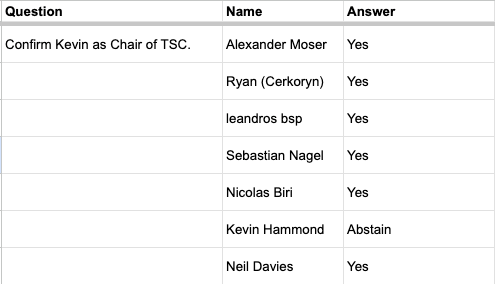

# Meeting Minutes December 03, 2025

## Attendees:&#x20;

| Name              | Attendance | Role            | Voting Seat (Y/N) | Term         |
| ----------------- | ---------- | --------------- | ----------------- | ------------ |
| Kevin Hammond     | Yes        | Chair           | Y                 | October 2026 |
| TBC               | No         | Vice Chair      | Y                 | October 2026 |
| Bosko Majdanac    | Yes        | Secretary       | N                 | N/A          |
| Tex McCutcheon    | Yes        | Alt - Secretary | N                 | N/A          |
| Nicolas Biri      | Yes        | Member/Seat     | Y                 | April 2026   |
| Duncan Coutts     | No         | Member/Seat     | Y                 | April 2026   |
| Sebastian Nagel   | Yes        | Member/Seat     | Y                 | April 2026   |
| Neil Davies       | Yes        | Member/Seat     | Y                 | April 2026   |
| Alexander Moser   | Yes        | Member/Seat     | Y                 | April 2026   |
| Ryan Wiley        | Yes        | Member/Seat     | Y                 | October 2026 |
| Udai Solanki      | No         | Member/Seat     | Y                 | October 2026 |
| Leandros Holleman | Yes        | Member/Seat     | Y                 | October 2026 |
| Seungheon Oh      | No         | Member/Seat     | Y                 | October 2026 |

Community/Other Attendees

* Christian Taylor
* Simo Simovic
* Tevo Kask

**Recording:** [Technical Steering Committee - 2025/12/03 - Recording](https://drive.google.com/file/d/1Vuq77ShkYoMAqEfxZaDQArEMei6A5wjP/view?usp=sharing)

**Transcript:** [Technical Steering Committee - 2025/12/03 - Transcript](https://docs.google.com/document/d/12g5m_O5Ht1YKOX1c63mnsWmDa8d8gzfKpX5Cx_RcVAU/edit?usp=sharing)

**Chat Transcript:** [Technical Steering Committee - 2025/12/03 - Chat Transcript](https://drive.google.com/file/d/1Oyg2c0vapWy-16HtQbY9qoD4CXCv2w0E/view?usp=sharing)

**Polls:** [Technical Steering Committee - 2025/12/03 - Polls](https://docs.google.com/spreadsheets/d/13JtWezZluaxu3EFvlD4Fc_rQBiCLWb7nclQqsRLmSD8/edit?usp=sharing)

## Intros

**Alex:** Head of Infrastructure, Cardano Foundation, TSC member, Parameter Committee\
co-chair, CF, Drep\
**Bosko:** Senior Project Manager, Intersect Staff, TSC Secretary\
**Duncan:** TBD\
**Kevin:** TSC Chair, Founder at Ensurable Systems\
**Leo:** Developer@KeyPackt/AnetaV2/GenWealth single pool SPO, CEO LnLlabs, TSC member\
**Neil:** TSC, Network Params, PNSol Ltd\
**Nicolas:** TSC member, Director of Software Architecture at IOG\
**Ryan:** TSC member, Cybersecurity Penetration Tester\
**Sebastian:** TSC member, Software Architect, nCoding and IOE\
**Tex:** OS Program Manager (Intersect), TSC/OSC Secretary, Committee Liaison\
**Udai:** Member OSC and TSC, AIQUANT Technologies

## Agenda 12.03.25

* Actions from the last meeting
* Committee Rewards Process
* Chair Elections
* Hard Fork Working Group
* Chain Incident Partition Working Group
* GitHub Health Files
* Parameter Committee Status
* Holiday Meeting Schedule
* 2030 Vision and 2026 Budget
* TSC Role
* TSC operational budget
* Seat 10?

## Decisions/Actions

Decisions

* **Chair Election:** Kevin was unanimously elected and confirmed as the Committee Chair (by acclamation, with Kevin abstaining from the vote).
* 
* **GitHub Health Files:** The proposal to use GitHub Health Files to standardize configurations across Intersect repositories was approved.
* **Holiday Cadence:** The committee agreed to suspend meetings on Wednesday, December 24th, and Wednesday, December 31st, and to reconvene on Wednesday, January 7th, 2026.
* **Declining Rewards:** Alexander formally declined the reward for his committee work.

Actions

* **Terence** to resend the Slack invite to Leandros.&#x20;
* **All members** to check the Hard Fork Readiness Tracking Repository and provide suggestions/PRs to the coordinators.
* A summary of accepted CIPs for the Hard Fork is to be posted.
* The Hard Fork Working Group will meet on a two-week cadence.
* The Chain Partition Incident Working Group should focus on gathering and structuring data/evidence (e.g., via a controlled repository).
* **Tex/Christian** to look into integrating/using the GitHub Health Files standard.
* **Sebastian/Kevin** to check with Ziyang for the specific version of Plutus core/repository that will be used for Node version 10.7 or release candidate 11.
* **Kevin** will draft the TSC Operational Budget proposal and report back next week, sharing information for group discussion.
* The committee is to decide (via an out-of-band poll or next meeting) on how to handle the TSC member vacancy (run with nine members or appoint the next candidate). Poll was run in meeting, but did not reach a quorate decision.&#x20;
* **Bosko** to take up the matter of TSC inclusion in the 2026 budget discussion process with the Budget Committee.

| Topic                                  | Discussion                                                                                                                                                                                                                                                                                                                                                                        | Notes                                                                                                                                                                                                                                                                                        |
| -------------------------------------- | --------------------------------------------------------------------------------------------------------------------------------------------------------------------------------------------------------------------------------------------------------------------------------------------------------------------------------------------------------------------------------- | -------------------------------------------------------------------------------------------------------------------------------------------------------------------------------------------------------------------------------------------------------------------------------------------- |
| Welcome & Opening Remarks              | Kevin and Bosko greeted attendees. Kevin noted the proposed agenda was shared via chat and Slack, soliciting prioritization or additions.                                                                                                                                                                                                                                         | Action: Bosko to ping Simo regarding attendance.                                                                                                                                                                                                                                             |
| Competitors Funding via TSC            | Sebastian raised the issue of CIP Editors struggling to get funding through the new Catalyst process and suggested TSC/OSC operational budgets as a potential alternative funding source.                                                                                                                                                                                         | Discussion to be revisited when discussing the TSC Operational Budget. Tevo was welcomed as an observer.                                                                                                                                                                                     |
| TSC Member Reward Process              | Simo (ISC Secretary) ran through the new Committee Reward Policy: 500 ADA/month for elected members, 1,000 ADA/month for the Chair. Explained the bulk payment process (June-November inclusive) to be paid before Christmas. Steps include: KYC, Tax Form (W9/W8 BEN), and providing an ADA wallet address.                                                                      | Action: Members to complete KYC/Tax forms and provide wallet address via email from Simo this week. Deadline for initial test transaction is Tuesday. Rewards can be accepted or declined (unused ADA returns to Treasury). From January, the process will be automated via the member area. |
| Declining Rewards                      | Alexander asked about declining rewards, confirming that unused ADA is returned to the Treasury at the end of the budget cycle. Alexander declined the reward for now.                                                                                                                                                                                                            | Declination is not permanent and can be changed in the future by claiming via the member area starting in January. Members are liable for tax in their own jurisdiction.                                                                                                                     |
| Action Items from Last Meeting         | Kevin and Bosko briefly summarized progress on outstanding actions from the previous meeting.                                                                                                                                                                                                                                                                                     | The first three items are in progress. Kevin will initiate the operational budget proposal when time permits.                                                                                                                                                                                |
| Chair and Vice Chair Election          | Bosko reported that only Kevin put himself forward as a candidate following the call for nominations for both Chair and Vice Chair. Neil noted the Vice Chair position had zero candidates.                                                                                                                                                                                       | Proposal (Alexander, seconded by Neil): Elect Kevin as Chair by acclamation, noting he was the only candidate. Decision: Kevin was unanimously approved as Chair (with Kevin abstaining).                                                                                                    |
| DSC Hard Fork Working Group Update     | Kevin and Ryan reported on the meeting. Discussion focused on the Hard Fork scope (Plutus primitives via CIPs, UPLC case optimization, ledger bug fixing/security improvements). Intra-era hard fork, scope deliberately limited. Future hard fork scopes should be openly discussed with the community in advance.                                                               | Action: Summary of accepted CIPs to be posted. All members to check the readiness tracking repository and provide suggestions/PRs. Next meeting in two weeks (approx. Dec 16th).                                                                                                             |
| Hard Fork Rationale                    | Alexander questioned the need for an intra-era hard fork. Sebastian noted it provides less friction and acts as a rehearsal for future, bigger inter-era hard forks (e.g., Djykstra) to test decentralized updates. Kevin and Neil stressed the need for a regular cadence of updates and providing community-requested features.                                                 | Risk Acknowledged: Incomplete benchmarking of Plutus primitives would postpone the hard fork (Neil, Kevin).                                                                                                                                                                                  |
| Chain Partition Incident Working Group | Neil reported a draft remit and group name were adopted. The next meeting is this afternoon. The key issue is finding and financing an independent chair to ensure due diligence and establish a ground truth. Bosko asked about collecting data in the interim.                                                                                                                  | Action: The group should focus on gathering and structuring data/evidence (e.g., via a repository with history). The independent chair will require appropriate resources/budget. Output should be public as far as possible.                                                                |
| GitHub Health Files                    | Nicolas suggested using GitHub Health Files to standardize .dotfiles (e.g., code owners, issues, code of conduct) across Intersect repositories. Christian noted Tech already set up a template repo.                                                                                                                                                                             | Action: Tex/Christian to look into integrating/using the GitHub Health Files standard. Approved by the committee.                                                                                                                                                                            |
| Cardano Node Update                    | Kevin provided an update from the Release Working Group: 10.6 delayed due to LMDB memory issues. 10.7 is fast-following with LSM backend support and protocol version 11 support, but is unlikely for a 2025 release. Hard fork feature work is expected to be code complete next week (without full integration). Preview Testnet needs attention to fix the Genesis mode issue. | Hard fork is not expected this year. Action: Sebastian/Kevin to check with Ziyang for the version of Plutus core/repository for 10.7 or release candidate 11.                                                                                                                                |
| Parameter Committee Status             | Alexander reported that the current governance action is ratified on Preview/Pre-Prod. It was purposely postponed during the CC situation and the "no governance December" to respect the social contract. It will be put forward once the CC is resolved.                                                                                                                        | Parameter Committee work on Plutus cost models is dependent on feature completeness and benchmarking results, likely pushing discussion to January 2026.                                                                                                                                     |
| Holiday Meeting Cadence                | Kevin proposed suspending meetings on Wednesday, December 24th and Wednesday, December 31st, reconvening on Wednesday, January 7th, 2026.                                                                                                                                                                                                                                         | Agreed. This aligns with Intersect holidays.                                                                                                                                                                                                                                                 |
| TSC Member Stepping Down               | Terence reported a member needs to step away due to personal commitments. The committee needs to decide whether to run with the remaining nine members (minimum is seven) or appoint the next candidate from the election list. Neil raised concerns about the significant vote gap between the last elected member and the next candidate.                                       | Action: Discussion/Poll on how to handle the vacancy to be conducted out-of-band (or next week) to decide between operating with nine members or co-opting the next candidate.                                                                                                               |
